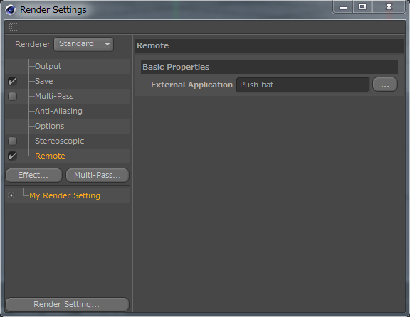

PushNotificate for C4D
===

# モチベーション

Cinema4Dでのレンダリング完了を任意のデバイス端末にPush通知したい。

# 方法

- Cinema4Dではレンダリング設定の`Remote`にレンダリング完了をフックして起動する実行パスを設定できる。
- push機能は[Pushbullet](https://www.pushbullet.com/)のAPIを使ってpythonで実装。Pushbulletアカウントを作成し、端末にAppをインストールする。

# アーキテクチャー

レンダリング設定の`Remote`パスにはスクリプトファイルを設定できなかった。(設定しても動作しない。)
`.exe`は実行できるようなのでpythonスクリプトをexe化する`py2exe`でexe化を試す。
が、パッケージングの際に組み込むモジュールに、今回の動作に必要なモジュールが足りないらしく動かない。
このあたり解決策がありそうだがよく分からない。
ので、最終的に`バッチファイル(.bat)`からスクリプトを実行すると動いた。

```
レンダリング完了 -> .batを実行 -> pythonを実行　-> Push!
```

# Setup

### Cinema4D 設定

レンダリング設定のRemoteにレンダリング完了をフックする起動アプリケーションを設定する。

- Render Setting -> Effect -> Remote -> External App [ Push.bat ]



### Python 設定
  
- 前提
  - Python2.7.xがインストールされていること
  - PIPコマンドが使えること

- 使用するライブラリ
  - pushbullet.py
    - https://github.com/randomchars/pushbullet.py

- コマンドラインでインストール
  - `pip install pushbullet.py`

### Pushbullet 設定

`config.json`を編集する。

```json
{
  "access_token" : "YOUR_ACCESS_TOKEN",
  "device_name"  : "YOUR_DEVICE_NAME",
  "send_title"   : "MESSAGE_TITLE",
  "send_body"    : "MESSAGE_BODY",
  "send_file"    : "FILE.png"
}
```

|項目|設定|
|:---:|:----|
|access_token|pushbulletのアカウント設定ページから`Access Token`をコピー|
|device_name|送信したいデバイス名|
|send_title|送信するメッセージタイトル|
|send_body|送信するメッセージ内容|
|send_file|プレビュー送信したい画像|

Enjoy!
